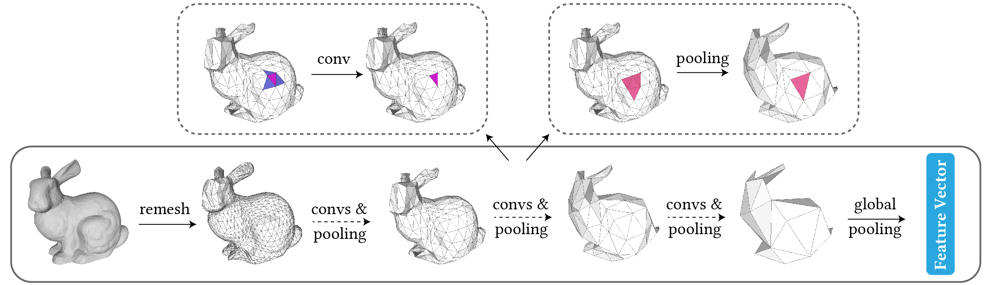

# Subdivision-based Mesh Convolutional Networks

The implementation of `SubdivNet` in our paper, [Subdivion-based Mesh Convolutional Networks](https://cg.cs.tsinghua.edu.cn/papers/TOG-2022-SubdivNet.pdf)



## News
* 🔥This paper was accepted by [ACM TOG](https://dl.acm.org/doi/10.1145/3506694). 

## Features
* Provides implementations of mesh classification and segmentation on various datasets.
* Provides ready-to-use datasets, pretrained models, training and evaluation scripts.
* Supports a batch of meshes with different number of faces.

## Requirements
* python3.7+
* CUDA 10.1+
* [Jittor](https://github.com/Jittor/jittor)

To install other python requirements:

```
pip install -r requirements.txt
```

## Fetch Data
This repo provides training scripts for classification and segementation, 
on the following datasets,

- shrec11-split10
- shrec11-split16
- cubes
- manifold40 (based on ModelNet40)
- humanbody
- coseg-aliens
- coseg-vases

To download the preprocessed data, run

```
sh scripts/<DATASET_NAME>/get_data.sh
```

> The `Manfold40` dataset (before remeshed, without subdivision connectivity) can be downloaded via [this link](https://cg.cs.tsinghua.edu.cn/dataset/subdivnet/datasets/Manifold40.zip). 
> Note that this version cannot be used as inputs of SubdivNet. To train SubdivNet, run scripts/manifold40/get_data.sh.

## Training
To train the model(s) in the paper, run this command:

```
sh scripts/<DATASET_NAME>/train.sh
```

To speed up training, you can use multiple gpus. First install `OpenMPI`: 

```
sudo apt install openmpi-bin openmpi-common libopenmpi-dev
```

Then run the following command,

```
CUDA_VISIBLE_DEVICES="2,3" mpirun -np 2 sh scripts/<DATASET_NAME>/train.sh
```

## Evaluation

To evaluate the model on a dataset, run:

```
sh scripts/<DATASET_NAME>/test.sh
```

The pretrained weights are provided. Run the following command to download them.

```
sh scripts/<DATASET_NAME>/get_pretrained.sh
```

## Visualize
After testing the segmentation network, there will be colored shapes in a `results` directory.

## How to apply SubdivNet to your own data
SubdivNet cannot be directly applied to any common meshes, because it requires the input to hold the subdivision connectivity.

To create your own data with subdivision connectivity, you may use the provided
tool that implements the MAPS algorithm. You may also refer to [NeuralSubdivision](https://github.com/HTDerekLiu/neuralSubdiv), as they provide a MATLAB script for remeshing.

To run our implemented MAPS algorithm, first install the following python dependecies,

```
triangle
pymeshlab
shapely
sortedcollections
networkx
rtree
```

Then see `datagen_maps.py` and modify the configurations to remesh your 3D shapes for subdivision connectivity.

## Cite
Please cite our paper if you use this code in your own work:

```
@article{DBLP:journals/tog/HuLGCHMM22,
  author    = {Shi{-}Min Hu and
               Zheng{-}Ning Liu and
               Meng{-}Hao Guo and
               Junxiong Cai and
               Jiahui Huang and
               Tai{-}Jiang Mu and
               Ralph R. Martin},
  title     = {Subdivision-based Mesh Convolution Networks},
  journal   = {{ACM} Trans. Graph.},
  volume    = {41},
  number    = {3},
  pages     = {25:1--25:16},
  year      = {2022},
  url       = {https://doi.org/10.1145/3506694},
  doi       = {10.1145/3506694}
}
```
